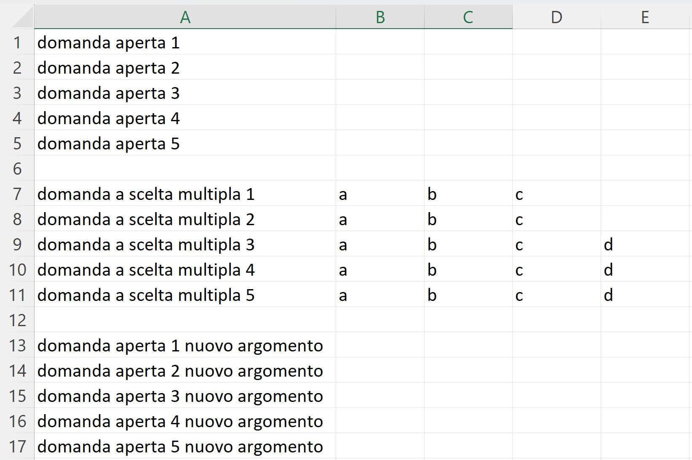

# EvilProf 😈 - Versione 1.1

Generatore di verifiche PDF selezionando un numero esatto di domande per blocco da Excel/CSV (Streamlit App)

[English Version](#english-version)

---

## 🇮🇹 Istruzioni e Preparazione File Excel/CSV (Logica a Blocchi)

EvilProf (Versione Blocchi) genera verifiche PDF selezionando un numero esatto di domande da blocchi definiti nel tuo file Excel o CSV.

**Caratteristiche:**

* **Input da Excel/CSV:** Carica un file `.xlsx`, `.xls` o `.csv`.
* **Struttura a Blocchi:** Organizza le domande in blocchi separati da **una riga completamente vuota**.
* **Tipi di Blocco:** Ogni blocco deve contenere **solo domande a scelta multipla** OPPURE **solo domande aperte**. L'app rileva automaticamente il tipo. Non mischiare i tipi nello stesso blocco.
* **Selezione Esatta:** Dopo aver caricato il file, potrai specificare nella sidebar **quante domande esatte (`k`)** vuoi selezionare da ciascun blocco identificato (che contiene `n` domande).
* **Randomizzazione e Diversità:**
    * Se per un blocco il numero totale di domande disponibili (`n`) è **strettamente maggiore** del doppio delle domande richieste (`k`) (cioè, **`n > 2k`**), l'applicazione userà un **Campionamento Ponderato (WRSwOR)** per selezionare le `k` domande da quel blocco. Questo metodo tenta di evitare la ripetizione immediata delle stesse domande *da quel blocco* nelle verifiche consecutive.
    * Se invece **`n <= 2k`** (cioè se chiedi la metà o più delle domande disponibili nel blocco), l'applicazione userà un **Campionamento Casuale Semplice** per selezionare le `k` domande da quel blocco, perdendo la garanzia di diversità tra test consecutivi per quel blocco.
    * Il fallback a campionamento casuale semplice può attivarsi anche per WRSwOR se le richieste (`k`) sono alte rispetto ai candidati *nuovi* disponibili in quel momento.
* **Output PDF:** Genera un singolo file PDF con le verifiche composte secondo le tue selezioni.
* **Test Funzionale:** Include un test statistico (Monte Carlo) che analizza la similarità (tramite coefficiente di Dice) tra verifiche generate consecutivamente al variare del numero di domande richieste per blocco (`k`), usando un file di test dedicato (`test_set_4_by_12_questions.xlsx`). I risultati vengono salvati in un file Excel.

**Preparazione File Excel/CSV:**

1.  Inizia a inserire le domande del primo blocco (tutte MC o tutte OE) dalla riga 1.
    * **Colonna A (o prima colonna):** Testo della domanda.
    * **Colonne B, C,... (o successive, solo per MC):** Opzioni di risposta. Lasciare vuote per domande Aperte.
2.  Quando vuoi iniziare un nuovo blocco (di tipo uguale o diverso), **inserisci una riga completamente vuota**.
3.  Nella riga successiva a quella vuota, inizia a inserire le domande del nuovo blocco.
4.  Ripeti i passaggi 2 e 3 per tutti i blocchi desiderati.
5.  **Non inserire nomi di argomento o intestazioni di colonna.**

*Vedi immagini di esempio qui sotto (assicurati che i file `.jpg` siano nella root del repository):*

---

---

## 🇬🇧 English Version 

EvilProf generates PDF tests by selecting an exact number of questions from blocks defined in your Excel or CSV file.

**Features as of 1.1:**

* **Input from Excel/CSV:** Load an `.xlsx`, `.xls`, or `.csv` file.
* **Block Structure:** Organize questions into blocks separated by **a completely empty row**.
* **Block Types:** Each block must contain **only multiple-choice questions** OR **only open-ended questions**. The app detects the type automatically. Do not mix types within the same block.
* **Exact Selection:** After uploading the file, you can specify in the sidebar **exactly how many questions (`k`)** you want to select from each identified block (which contains `n` questions).
* **Randomization and Diversity:**
    * If, for a block, the total number of available questions (`n`) is **strictly greater** than twice the requested questions (`k`) (i.e., **`n > 2k`**), the application will use **Weighted Sampling (WRSwOR)** to select the `k` questions from that block. This method attempts to avoid immediate repetition of the same questions *from that block* in consecutive tests.
    * If **`n <= 2k`** (i.e., if you request half or more of the available questions in the block), the application will use **Simple Random Sampling** to select the `k` questions from that block, losing the diversity guarantee between consecutive tests for that block.
    * Fallback to simple random sampling may also occur for WRSwOR if requests (`k`) are high relative to the *new* available candidates at that moment.
* **PDF Output:** Generates a single PDF file with the tests composed according to your selections.
* **Functional Test:** Includes a statistical test (Monte Carlo) that analyzes the similarity (using Dice coefficient) between consecutively generated tests as the number of requested questions per block (`k`) varies, using a dedicated test file (`test_set_4_by_12_questions.xlsx`). Results are saved to an Excel file.

**Excel/CSV File Preparation:**

1.  Start entering questions for the first block (all MC or all OE) from row 1.
    * **Column A (or first column):** Question text.
    * **Columns B, C,... (or subsequent, MC Only):** Answer options. Leave empty for Open-Ended questions.
2.  When you want to start a new block, **insert a completely empty row**.
3.  On the row after the empty one, start entering the questions for the new block.
4.  Repeat steps 2 and 3 for all desired blocks.
5.  **Do not include topic names or column headers.**

*See example images below (ensure the `.jpg` files are in the repository root):*

---

---

*(README updated for the block-based version with unified sampling logic and i18n)*

