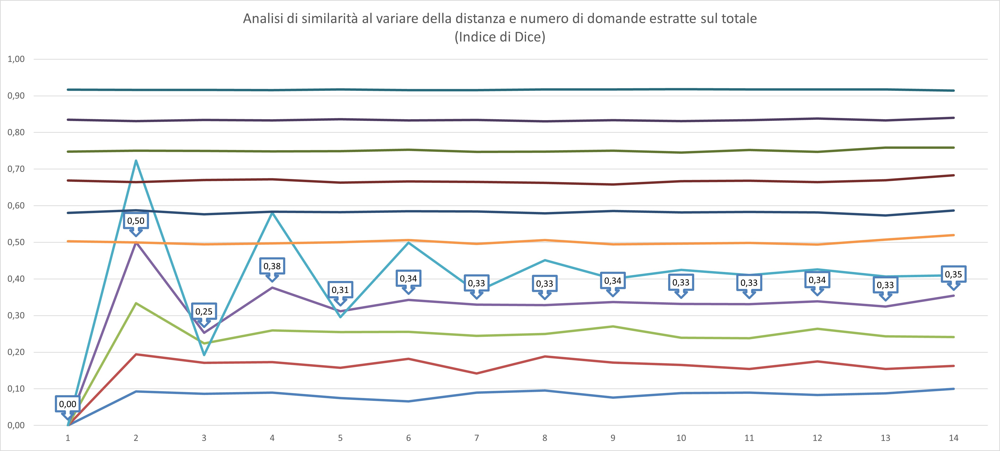

# EvilProf 😈 - v1.1.2
[Click here to go the app!](evilprof.streamlit.app)

Generatore di verifiche PDF diverse con campionamento casuale ponderato delle domande. Test adiacenti sono  _completamente_ diversi!

[English](#english-version)

---

## 🇮🇹 Istruzioni e Preparazione File Excel/CSV (Logica a Blocchi)

EvilProf (Versione Blocchi) genera verifiche PDF selezionando un numero esatto di domande da blocchi definiti nel tuo file Excel o CSV.

I test hanno la garanzia della completa diversità se adiacenti, e le domande scelte hanno una minore probabilità di essere selezionate per i test successivi con una pesatura esponenziale decrescente.

**Caratteristiche:**

* **Input da Excel/CSV:** Carica un file `.xlsx`, `.xls` o `.csv`.
* **Struttura a Blocchi:** Organizza le domande in blocchi separati da **una riga completamente vuota**.
* **Tipi di Blocco:** Ogni blocco deve contenere **solo domande a scelta multipla** OPPURE **solo domande aperte**. L'app rileva automaticamente il tipo. Non mischiare i tipi nello stesso blocco.
* **Selezione Esatta:** Dopo aver caricato il file, potrai specificare nella sidebar **quante domande esatte (`k`)** vuoi selezionare da ciascun blocco identificato (che contiene `n` domande).
* **Randomizzazione e Diversità:**
    * Se per un blocco il numero totale di domande disponibili (`n`) è **strettamente maggiore** del doppio delle domande richieste (`k`) (cioè, **`n > 2k`**), l'applicazione userà un **Campionamento Ponderato (WRSwOR)** per selezionare le `k` domande da quel blocco. Questo metodo tenta di evitare la ripetizione immediata delle stesse domande *da quel blocco* nelle verifiche consecutive.
    * Se invece **`n <= 2k`** (cioè se chiedi la metà o più delle domande disponibili nel blocco), l'applicazione userà un **Campionamento Casuale Semplice** per selezionare le `k` domande da quel blocco, perdendo la garanzia di diversità tra test consecutivi per quel blocco.
    * Il fallback a campionamento casuale semplice può attivarsi anche per WRSwOR se le richieste (`k`) sono alte rispetto ai candidati *nuovi* disponibili in quel momento.
* **Output PDF:** Genera un singolo file PDF con le verifiche composte secondo le tue selezioni.

**Preparazione File Excel/CSV:**

1.  Inizia a inserire le domande del primo blocco (tutte MC o tutte OE) dalla riga 1.
    * **Colonna A (o prima colonna):** Testo della domanda.
    * **Colonne B, C,... (o successive, solo per MC):** Opzioni di risposta. Lasciare vuote per domande Aperte.
2.  Quando vuoi iniziare un nuovo blocco (di tipo uguale o diverso), **inserisci una riga completamente vuota**.
3.  Nella riga successiva a quella vuota, inizia a inserire le domande del nuovo blocco.
4.  Ripeti i passaggi 2 e 3 per tutti i blocchi desiderati.
5.  **Non inserire nomi di argomento o intestazioni di colonna.**

*Vedi immagine di esempio qui sotto:*

---

### Analisi Statistica (Test Funzionale)

L'applicazione include un test funzionale accessibile dalla sidebar. Questo test:

1.  Utilizza un file predefinito (`test_set_4_by_12_questions.xlsx`) contenente 4 blocchi di 12 domande ciascuno (2 blocchi MC, 2 blocchi OE).
2.  Esegue una simulazione Monte Carlo (30 ripetizioni) per diversi scenari di selezione.
3.  Per ogni scenario, varia il numero di domande richieste per blocco (`k`) da 1 a 11.
4.  Genera sequenze di 15 test consecutivi per ogni `k` e ogni run Monte Carlo, applicando la logica di campionamento appropriata (WRSwOR se `12 > 2k`, Simple Random se `12 <= 2k`).
5.  Calcola la similarità media tra test consecutivi a diverse "distanze" (da 1 a 14 test di distanza) usando il **coefficiente di Sørensen-Dice**. Un valore di 0 indica nessuna domanda in comune, 1 indica test identici.
6.  Salva i risultati medi finali (per ogni `k` e distanza) in un file Excel (`similarity_analysis_unified_dice_mc_15t.xlsx`), che può essere scaricato dall'interfaccia.

**Interpretazione dei Risultati:**

* **Distanza 1:** L'indice di Dice dovrebbe essere molto vicino a 0 per `k` da 1 a 5 (dove si usa WRSwOR e `n > 2k`), indicando alta diversità tra test immediatamente consecutivi. Per `k` da 6 a 11 (dove si usa Simple Random), ci si aspetta un Dice > 0 già a distanza 1.
* **Distanze Maggiori (d > 1):** L'effetto "memoria" di WRSwOR si attenua rapidamente. La similarità media tende a convergere verso il valore atteso per un campionamento casuale semplice (che dipende da `k`). Ad esempio, per `k=6` (12 domande totali su 48), la similarità converge a circa 0.25.
* **Soglia `k=6` (n=2k):** Questo test permette di osservare il comportamento al limite e oltre la soglia dove il campionamento passa da WRSwOR a Simple Random.
* **Consiglio Pratico:** Per massimizzare la diversità tra test consecutivi usando WRSwOR, è consigliabile scegliere un numero di domande per blocco (`k`) significativamente inferiore alla metà delle domande disponibili (`n/2`), idealmente `k <= n/3` (es. `k=4` per un blocco da 12).

*Vedi immagine di esempio dell'analisi qui sotto:*

---

## 🇬🇧 English Version 

EvilProf (Block Version) generates PDF tests by selecting an exact number of questions from blocks defined in your Excel or CSV file.

**Features:**

* **Input from Excel/CSV:** Load an `.xlsx`, `.xls`, or `.csv` file.
* **Block Structure:** Organize questions into blocks separated by **a completely empty row**.
* **Block Types:** Each block must contain **only multiple-choice questions** OR **only open-ended questions**. The app detects the type automatically. Do not mix types within the same block.
* **Exact Selection:** After uploading the file, you can specify in the sidebar **exactly how many questions (`k`)** you want to select from each identified block (which contains `n` questions).
* **Randomization and Diversity:**
    * If, for a block, the total number of available questions (`n`) is **strictly greater** than twice the requested questions (`k`) (i.e., **`n > 2k`**), the application will use **Weighted Sampling (WRSwOR)** to select the `k` questions from that block. This method attempts to avoid immediate repetition of the same questions *from that block* in consecutive tests.
    * If **`n <= 2k`** (i.e., if you request half or more of the available questions in the block), the application will use **Simple Random Sampling** to select the `k` questions from that block, losing the diversity guarantee between consecutive tests for that block.
    * Fallback to simple random sampling may also occur for WRSwOR if requests (`k`) are high relative to the *new* available candidates at that moment.
* **PDF Output:** Generates a single PDF file with the tests composed according to your selections.

**Excel/CSV File Preparation:**

1.  Start entering questions for the first block (all MC or all OE) from row 1.
    * **Column A (or first column):** Question text.
    * **Columns B, C,... (or subsequent, MC Only):** Answer options. Leave empty for Open-Ended questions.
2.  When you want to start a new block, **insert a completely empty row**.
3.  On the row after the empty one, start entering the questions for the new block.
4.  Repeat steps 2 and 3 for all desired blocks.
5.  **Do not include topic names or column headers.**

*See example image below:*

---

### Statistical Analysis (Functional Test)

The application includes a functional test accessible from the sidebar. This test:

1.  Uses a predefined file (`test_set_4_by_12_questions.xlsx`) containing 4 blocks of 12 questions each (2 MC blocks, 2 OE blocks).
2.  Runs a Monte Carlo simulation (30 repetitions) for different selection scenarios.
3.  For each scenario, it varies the number of questions requested per block (`k`) from 1 to 11.
4.  Generates sequences of 15 consecutive tests for each `k` and each Monte Carlo run, applying the appropriate sampling logic (WRSwOR if `12 > 2k`, Simple Random if `12 <= 2k`).
5.  Calculates the average similarity between consecutive tests at different "distances" (from 1 to 14 tests apart) using the **Sørensen-Dice coefficient**. A value of 0 indicates no common questions, 1 indicates identical tests.
6.  Saves the final average results (for each `k` and distance) to an Excel file (`similarity_analysis_unified_dice_mc_15t.xlsx`), which can be downloaded from the interface.

**Interpreting the Results:**

* **Distance 1:** The Dice index should be very close to 0 for `k` from 1 to 5 (where WRSwOR is used and `n > 2k`), indicating high diversity between immediately consecutive tests. For `k` from 6 to 11 (where Simple Random is used), Dice > 0 is expected even at distance 1.
* **Greater Distances (d > 1):** The "memory" effect of WRSwOR quickly fades. The average similarity tends to converge towards the value expected for simple random sampling (which depends on `k`). For example, for `k=6` (12 total questions out of 48), the similarity converges to about 0.25.
* **Threshold `k=6` (n=2k):** This test allows observing the behavior at and beyond the threshold where sampling switches from WRSwOR to Simple Random.
* **Practical Advice:** To maximize diversity between consecutive tests using WRSwOR, it's advisable to choose a number of questions per block (`k`) significantly less than half the available questions (`n/2`), ideally `k <= n/3` (e.g., `k=4` for a block of 12).

*See example image of the analysis below:*

---

*(README updated for the block-based version with unified sampling logic, i18n, and statistical test description)*
